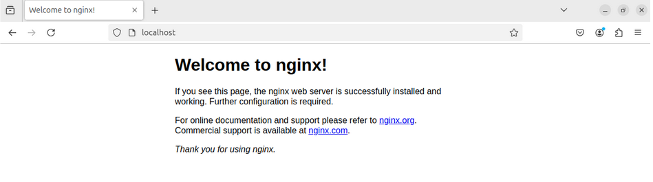

# Example 1a: Deployment of NGINX Web Server

Enter the directory "/etc/ansible":
```bash
cd /etc/ansible
```

To start the configuration you must setup the inventroy file, which can be in two formats:
  -  hosts(.ini) 
  -  hosts.yml

The default file is "hosts", you can modify it by using the command:
```bash
sudo nano hosts
```

The file "hosts" should look similar to:
```bash
nginx_node  ansible_host=192.168.56.251 ansible_user=samanta ansible_ssh_private_key_file=/home/samanta/.ssh/id_rsa
```

- nginx_node: is the alias of the Node we want to connect to via SSH using Ansible
- ansible_host=192.168.56.251: specifies the IP address of the host-only network adapter of the target VM. Modify this address to match the actual IP of the VM "Nginx_Node", executing the followinf command from the terminal of the VM "NGINX_Node"
```bash
ip -color a
```
- ansible_user=samanta: specifies the username used to connect to the VM "NGINX_Node" via SSH
- ansible_ssh_private_key_file=/home/samanta/.ssh/id_rsa: defines the path to the private SSH key used for authentication when connecting to the target VM from the "Ansible_Control_Node". Ensure that the key has the correct permissions and corresponds to the public key on the "Nginx_Node"

In case you want to uuse the inventory file hosts.yml, it should look like:
```bash
---
all:
  hosts:
    nginx_node: 
      ansible_host: 192.168.56.251
      ansible_user: samanta
      ansible_ssh_private_key_file: /home/samanta/.ssh/id_rsa
```

Once you have configured a inventory file, you should setup the environmen by defining the ansible.cfg file, as follows:
```bash
[defaults]
inventory = /etc/ansible/hosts
host_key_checking = False
```
Where:
inventory specifies the folder to search for the inventory file
host_key_checking = False simplifies the SSH connection (but increases security risks for the communication)

To verify that the VM "Ansible_Control_Node" can communicate with the specified hosts, run the following command from the terminal:
```bash
ansible all -m ping
```


# Playbook nginx.yml

Create a new directory, using the command:
```bash
sudo mkdir playbooks
```

Then enter the directory "playbooks":
```bash
cd playbooks
```

And now create the playbook "nginx.yml":
```bash
sudo nano nginx.yml
```

nginx.yml:
```bash
---
- hosts: nginx-node
  become: yes
  tasks:
    - name: "apt-get update"
      apt:
        update_cache: yes
        cache_valid_time: 3600

    - name: "install nginx"
      apt:
        name: ['nginx']
        state: latest
```
The playbook defines “become: yes”, which means the tasks will be executed with root privileges
For proper execution, the ansible_sudo_pass variable must be included in the inventory file (hosts.ini or hosts.yml), which provides the root password for the managed VM user

Modify the inventory file "hosts":
```bash
cd ..
```
```bash
sudo nano hosts
```

File "hosts", add "ansible_sudo_pass=password":
```bash
nginx_node ansible_host=192.168.56.251 ansible_user=samanta ansible_ssh_private_key_file=/home/samanta/.ssh/id_rsa ansible_sudo_pass=password
```
If you are using the hosts.yml file, modify it as follows:
```bash
---
all:
 hosts:
   nginx_node: 
    ansible_host: 192.168.56.251
    ansible_user: samanta
    ansible_sudo_pass: password
    ansible_ssh_private_key_file: /home/samanta/.ssh/id_rsa
```

Now you can run the playbook nginx.yml
```bash
cd playbooks
```
```bash
ansible-playbook nginx.yml
```

Now you can open the VM "NGINX_Node" and connect to: http://localhost:80
And you should see  the "Welcome to NGINX" page


