# Exercise 2: Configuration of a Prometheus and Grafana Monitoring System

Installation and configuration of the Prometheus + Grafana stack on the Monitoring_Node VM to monitor the NGINX_Node VM (target node)


## Add Monitoring node to the inventory file hosts:
```bash
cd /etc/ansible
sudo nano hosts
```
Add your vm monitoring node, the configuration should be similar to:
```bash
monitoring_node ansible_host=192.168.56.252 ansible_user=samanta ansible_ssh_key_file=/home/samanta/.ssh/id_rsa ansible_sudo_pass=admin
```
- **monitoring_node:** is the alias of the Node we want to connect to via SSH using Ansible
- **ansible_host=192.168.56.251:** specifies the IP address of the host-only network adapter of the target VM. Modify this address to match the actual IP of the VM "Monitoring_Node", executing the following command from the terminal of the VM "Monitoring_Node"
```bash
ip -color a
```
- **ansible_user=samanta:** specifies the username used to connect to the VM "Monitoring_Node" via SSH
- **ansible_ssh_private_key_file=/home/samanta/.ssh/id_rsa:** defines the path to the private SSH key used for authentication when connecting to the target VM from the "Ansible_Control_Node". Ensure that the key has the correct permissions and corresponds to the public key on the "Monitoring_Node"


## Create the required Ansible roles
From the Ansible Control Node, navigate to the roles directory:
```bash
cd roles
```
And create the roles:
```bash
sudo ansible-galaxy init grafana
```
```bash
sudo ansible-galaxy init prometheus
```
```bash
sudo ansible-galaxy init node-exporter
```

## Configure Node Exporter on NGINX_Node
Navigate to the **Node Exporter** tasks directory:
```bash
cd node-exporter/tasks
```
Edit the main.yml file:
```bash
sudo nano main.yml
```
Add the following configuration:
```bash
---
# tasks file for node-exporter
- name: "apt-get update"
  apt:
    update_cache: yes
    cache_valid_time: 3600

- name: "Install node-exporter"
  apt:
    name: ['prometheus-node-exporter']
    state: latest

- name: "Output Node-exporter"
  debug:
    msg: "Connect from the NGINX_Node to http://localhost:9100/metrics"
```
Save and exit (CTRL + X, then Y to confirm)

## Configure Prometheus on Monitoring_Node
### Configure Prometheus tasks
Navigate to the Prometheus tasks directory:
```bash
cd ../../prometheus/tasks
```
Edit the main.yml file:
```bash
sudo nano main.yml
```
Add the following configuration:
```bash
---
# tasks file for prometheus
- name: "apt-get update"
  apt:
    update_cache: yes
    cache_valid_time: 3600

- name: "Install & update prometheus"
  apt:
    name: ['prometheus']
    state: latest
    update_cache: yes
    cache_valid_time: 3600

- name: "Ensure Prometheus configuration directory exists"
  file:
    path: "{{ prom_dir_config }}"
    state: directory
    owner: prometheus
    group: prometheus
    mode: '0755'

- name: "Move the configuration file template"
  template:
    src: ../templates/prometheus.yml.j2
    dest: "{{ prom_dir_config }}/prometheus.yml"
    mode: '0644'
    owner: prometheus
    group: prometheus

- name: "Restart prometheus"
  service:
    name: prometheus
    state: restarted
    enabled: yes

- name: "Output Prometheus"
  debug:
    msg: "Prometheus is running. Connect from the Monitoring_Node to http://localhost:9090"
```
Save and exit (CTRL + X, then Y)

### Configure Prometheus targets
Move to the directory roles/prometheus/templates:
```bash
cd ../templates
```
Edit the prometheus.yml.j2 file:
```bash
---
global:
  scrape_interval: {{ scrape_interval }}
  evaluation_interval: {{ evaluation_interval }}

scrape_configs:
  - job_name: "nginx_node"
    static_configs:
      - targets: ['{{ ansible_host_target }}:9100']
```
Save and exit (CTRL + X, then Y)

### Define Prometheus Variables
Move to the directory roles/prometheus/vars:
```bash
cd ../vars
```
Edit the main.yml file:
```bash
sudo nano main.yml
```
**Note.** In the variable ansible_host_target insert the IP of the VM you want to monitor (NGINX_Node):
```bash
---
# vars file for prometheus
prom_dir_config: "/etc/prometheus"
scrape_interval: "10s"
evaluation_interval: "10s"
ansible_host_target: "192.168.56.251"
```
Save and exit (CTRL + X, then Y)

## Configure Grafana on Monitoring_Node
Move to the directory /etc/ansible/roles/grafana/tasks:
```bash
cd ../../grafana/tasks
```
Edit main.yml:
```bash
sudo nano main.yml
```
Add the following configuration
```bash
---
# tasks file for grafana
- name: "Install gpg"
  apt:
    name: gnupg, software-properties-common
    state: present
    update_cache: yes
    cache_valid_time: 3600

- name: "add gpg key"
  apt_key:
    url: "https://packages.grafana.com/gpg.key"
    validate_certs: no

- name: "add repository"
  apt_repository:
    repo: "deb https://packages.grafana.com/oss/deb stable main"
    validate_certs: no

- name: "install and update Grafana"
  apt:
    name: grafana
    state: latest
    update_cache: yes
    cache_valid_time: 3600

- name: "Start service grafana-server"
  service:
    name: grafana-server
    enabled: true
    state: restarted

- name: "Check if Grafana is accessible"
  uri:
    url: http://127.0.0.1:3000
    method: GET
  register: __result
  until: __result.status == 200
  retries: 120
  delay: 1

- name: "Output Grafana"
  debug:
    msg: "Grafana is running. Connect from the Monitoring_Node to http://127.0.0.1:3000. Username: admin, Password: admin"
```
Save and exit (CTRL + X, then Y)


## Create the Ansible Playbook
Move to the playbooks directory:
```bash
cd ../../../playbooks
```
Create the playbook monitoring_system.yml:
```bash
sudo nano monitoring_system.yml
```
Add the following configuration:
```bash
---
- hosts: nginx_node
  become: yes
  vars_files:
    - /etc/ansible/roles/nginx/vars/nginx_vars.yml
  roles:
    - nginx
    - node-exporter

- hosts: monitoring_node
  become: yes
  vars_files:
    - /etc/ansible/roles/prometheus/vars/main.yml
  roles:
    - prometheus
    - grafana
```

Save and exit (CTRL + X, then Y)

### Execute the Ansible playbook monitoring_system.yml
Run the playbook to install and configure everything automatically:
```bash
ansible-playbook monitoring_system.yml
```

## Verify the correct installation on the NGINX Node VM
From the VM NGINX Node, connect to: http://localhost:9100/metrics
And on this page will be displayed the types of metrics that the node-exporter exposes to Prometheus
There are three types of metrics:
- **Gauge:** value that can increase or decrease over time
- **Counter:** metric that represents a monotonically increasing value
- **Histogram:** represents the distribution of a set of values over time
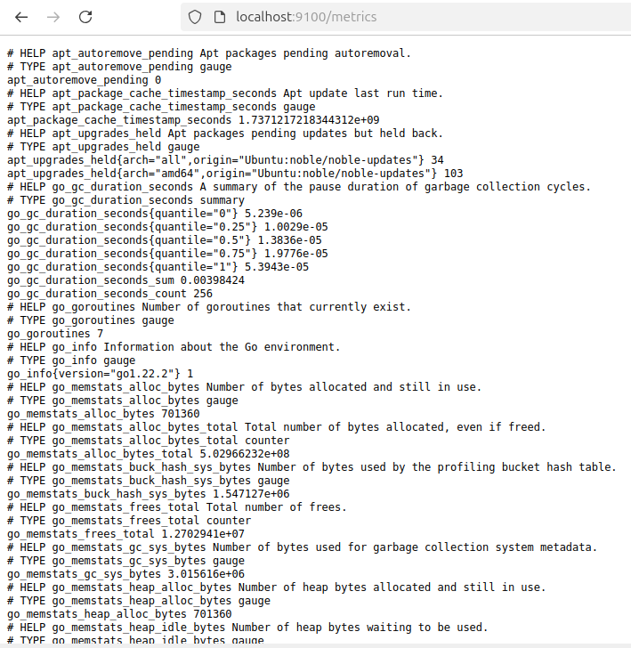

## Promethus Web UI
Once Prometheus is installed, the Web User Interface (UI) can be accessed from the Monitoring_Node VM by connecting to: http://localhost:9090
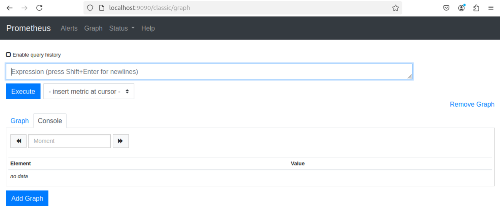
Once in the Web UI, the nodes that Prometheus is connected to can be viewed by clicking: “Status -> Targets”
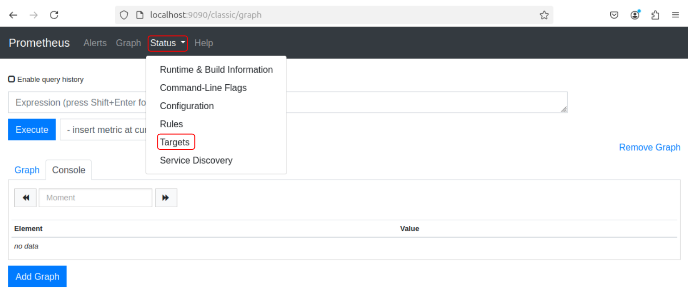
It is possible to check the monitored nodes and the configurations made in the "prometheus.yml" file (jobs_name and ansible_host_target)
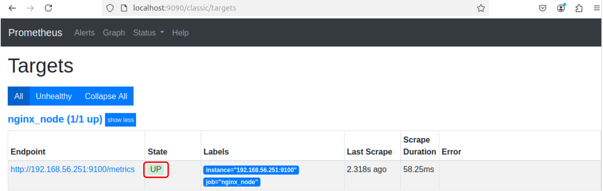

## Grafana configuration
Access the Grafana web application from the Monitoring_Node VM by connecting to: http://127.0.0.1:3000
Log in with the default credentials:
- username: admin
- password: admin


### Data Source
To view the data, the data source must be specified in Grafana:
1. Click on Data Sources
2. Select Prometheus from the available options
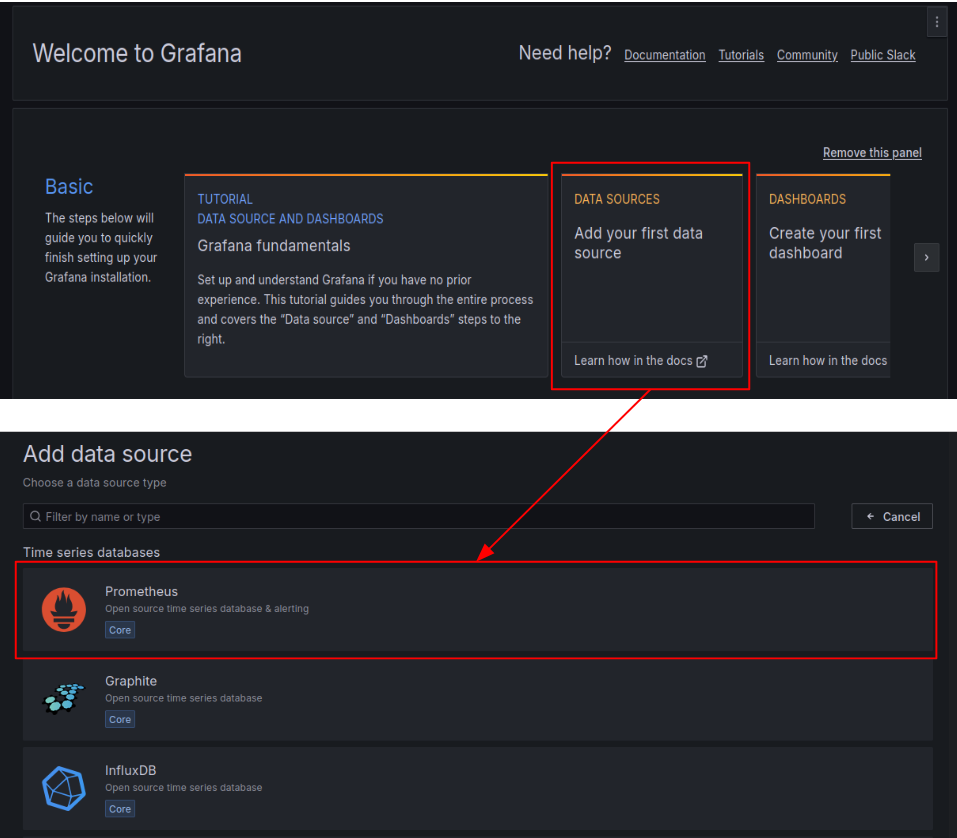

Configuring the Data Source:
1. The name to associate with the source
2. The address of the source. In this case, the Prometheus server, which serves as the data source to be displayed, is located on the same VM as Grafana, so enter: http://localhost:9090
Once entered, click “save & test” at the bottom of the page
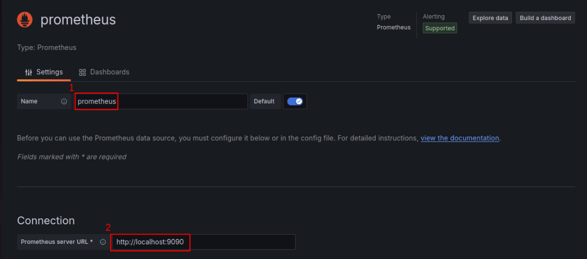

The monitored VM (NGINX_Node) hosts an NGINX web server. In addition to memory usage, it is possible to monitor network traffic as well
The following steps will show how to create a dashboard to monitor network traffic on the two interfaces of the NGINX VM

### Grafana dashboards
To create a new Dashboard, follow the highlighted boxes in the figure
1. This allows access to the Dashboard management panel


2. 	It allows the creation of a new Dashboard, a new folder to contain multiple Dashboards, or the import of a folder or a single dashboard
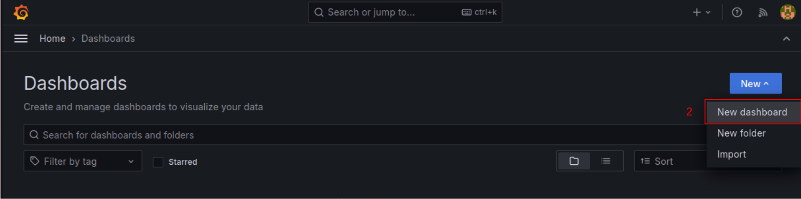


3. 	Select "Add visualization" to choose which data source to use
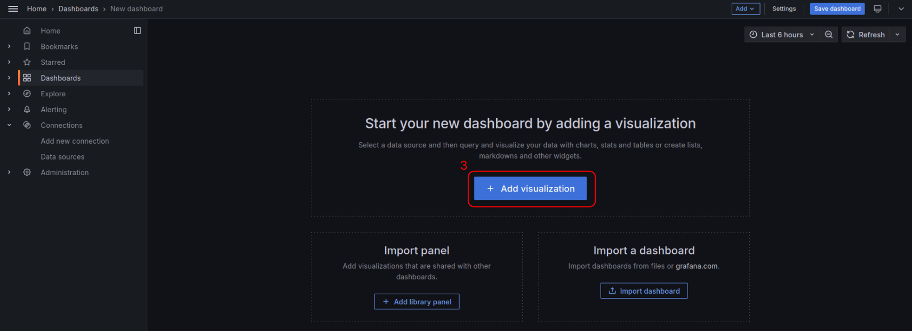

4.	Select Prometheus as data source
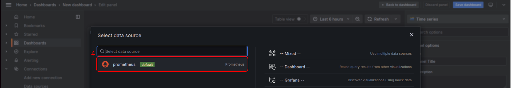

5.	Define the queries. Select Code (Builder is selected by default)
6. 	Enter the query
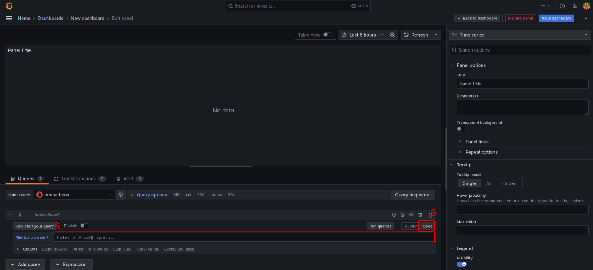

7. **First query: incoming traffic**: irate(node_network_receive_bytes_total{job=”nginx_node”, instance=”192.168.56.251”}[1m])
- irate() transforms the data provided by count-type metrics so that the actual trend (both positive and negative) of the metric inside the parentheses is shown on the graph. To do this, besides the metric, an evaluation interval must also be specified, in this case, [1m], which represents one minute
- node_network_receive_bytes_total and node_network_transmit_bytes_total are two count-type metrics that only provide monotonic incremental values, which does not allow for displaying a graph showing the traffic trend
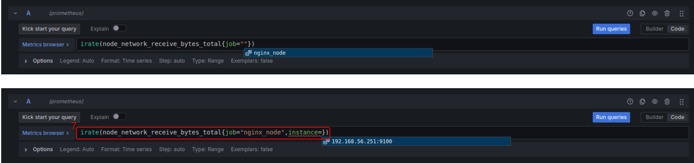

In the "legend" section, select the "custom" option from the list and enter: traffic IN
8. 	Press the "Add query" button
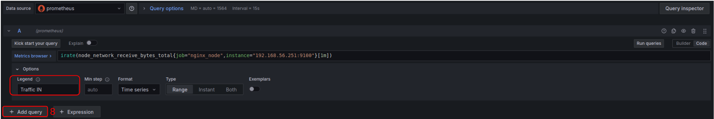

9. **Second query: outgoing traffic**: irate(node_network_transmit_bytes_total{job=”nginx_node”, instance=”192.168.56.251”}[1m])
In the legend, select the "custom" option from the list and enter: traffic OUT
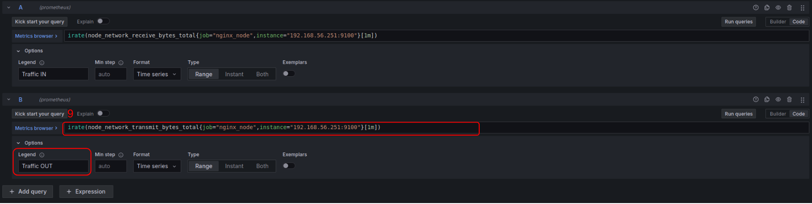

In the right menu, search for "unit" and select "data rate," then choose "kilobytes/sec"
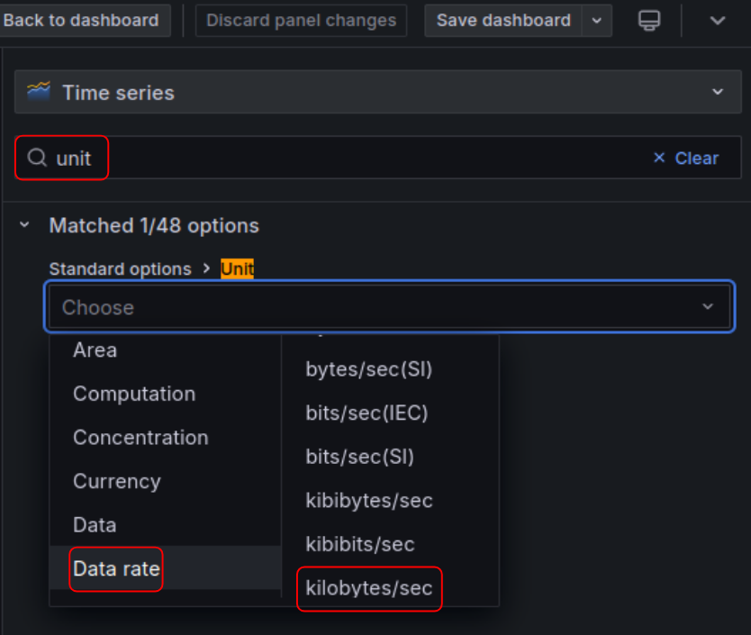

To make the graph easier to understand, in the legend enter {{device}}, so that the names of the monitored network interfaces (enp0s3, enp0s8) are displayed


To **verify** that the network interfaces match, open the terminal of the NGINX_Node VM and run the following command:
```bash
ip -color a
```
Where:
enp0s3: NAT network interface
enp0s8: host-only network interface


